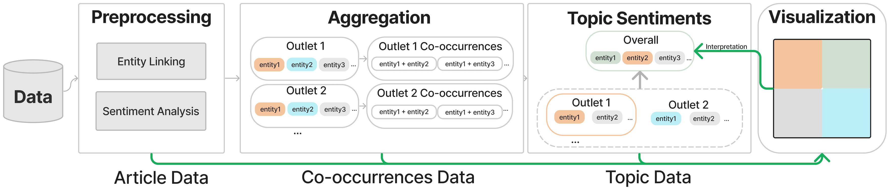

# NOVA: A visual interface for assessing polarizing media coverage
### We're on arxiv: https://arxiv.org/abs/2403.00334.
You can also access the interface through: https://samlee-dedeboy.github.io/Nova/
## Overview 
Within the United States, the majority of the populace receives their news online. U.S mainstream media outlets both generate and influence the news consumed by U.S citizens. Many of these citizens have their personal beliefs about these outlets and question the fairness of their reporting. We offer an interactive visualization system for the public to assess their perception of the mainstream media’s coverage of a topic against the data. Our system combines belief elicitation techniques and narrative structure designs, emphasizing transparency and user-friendliness to facilitate users' self-assessment on personal beliefs. We gathered $\sim${25k} articles from the span of 2020-2022 from six mainstream media outlets as a testbed. To evaluate our system, we present usage scenarios alongside a user study with a qualitative analysis of user exploration strategies for personal belief assessment. We report our observations from this study and discuss future work and challenges of developing tools for the public to assess media outlet coverage and belief updating on provocative topics.

## Preprocessing 
</img>
The data transformation process NOVA. 
Collected news articles were preprocessed with `entity linking` and `sentiment analysis`. 
Then articles are aggregated by entities and further aggregated by co-occurrences to represent topics. 
Sentiment scores are generated with descriptive statistics for each topic. 
The preprocessed article data, co-occurrences data, and topic sentiment data are all requested from the frontend. 
Green lines indicate data communication between the backend and the frontend. 

## Interface & Visualization Design
**_The interface is significantly updated in the latest version. Check out here: https://arxiv.org/abs/2403.00334_**

NOVA has two objectives:
- to allow general audiences to freely assess mainstream media coverage on a variety of topics and 
- to serve as a platform to facilitate the assessment of one's personal beliefs toward these outlets.

To address the first objective we take advantage of narrative visualization techniques and strategies to pace out the assessment and allow users to have more control over their process.
To support the second objective NOVA facilitates belief elicitation by facilitating users to express their beliefs about the topic and the outlet they choose and contrast their beliefs to the data.

NOVA's interface design has 3 stages: `Topic Selection`, `Belief Elicitation`, and `Article Review`.
In our design, people are allowed to navigate between stages as they please, while the system keeps track of the data and any changes between stages.
We incorporate modals and annotations to help direct user attention and to provide context for what they are assessing.
The system, in the first two stages, adjusts the visualizations to reflect their beliefs allowing them to form a hypothesis based on their existing beliefs and then evaluate them in the third stage.
### Stage 1: Topic Selection
</img>
A screenshot of the `Topic Selection` stage. 

(a) A table of entities and their number of mentioned articles. 

(b) The sentiment scatter plot shows two-dimensional sentiment for each topic. The region is divided into four categories: mixed, positive, negative, and neutral. 

(c) The utility panel contains a filter and a color scale legend on article frequency.

(d) By choosing a topic from (a) or (b), users can see the statistics
for the topic, and they can choose an outlet to inspect further.

<!-- (a) The topic scatter plot shows two-dimensional sentiment for each topic. 
The region is divided into four categories to separate polarizing (mixed), positive, negative, and neutral topics. 

(b) Topic controllers that provide filter functionality and sliders to adjust outlet fairness. 

(c) Clicking any topic in (a) triggers the visualization of frequently co-occurring topics with the selected topic in (c). 

(d) Policy coverage distribution on the selected topic and co-occurring topic.  -->

### Stage 2: Belief Elicitation
</img>
A screenshot of the Belief Elicitation stage. 

(a) To externalize a user’s belief, the user can drag the topic hexagons to the corresponding
sentiment category or click the center hexagon to adjust its sentiment.

(b) After clicking the question mark, NOVA reveals the data hive
and highlights the discrepancies between the user’s belief and the
data, motivating the user to investigate the conflict.
<!-- The Outlet Comparison stage provides an overview visualization of news outlet coverage.  -->

<!-- (a) A grid layout showing the topic co-occurrences hive for each media outlet. The topics all have fixed positions for easy cross-comparison. 

(b) A sidebar with statistical detail of selected co-occurring topics, a legend, and a Note Panel to document any hypothesis or questions user generated from the visualization. 

(c) Sentiment Scatterplot showing the sentiment scores for co-occurring entities of the selected outlet. -->

### Stage 3: Article Reviewer
</img>
A screenshot of the Article Reviewer stage. 
(a) Article Panel shows positive and negative articles in two columns. 
(b) depicts the annotated content of a selected article.
(c) Notes Panel for documenting insights. Clicking the paragraph in (b) creates a “reference” in the note. 
(d) The user and data hives are displayed. Users can click a hexagon to inspect its articles. After the exploration, users can click the “Try another” button on the top-right corner to explore another outlet.
<!-- (a) Article Panel showing positive and negative articles on the selected topic in separate columns.  

(b) Article Reviewer Panel showing the headline and summary of the selected article. Users can use the `Fair/Unfair` button to mark the article. 

(c) Note Panel showing the hypothesis documented in the previous stage. Any additional thoughts can be added as well. 

(d) The Outlet Coverage view indicates to users which outlet articles they are inspecting, and provides functionality to switch topics or outlets. 

(e) Marked Articles view records any marked articles users deemed fair or unfair. Clicking on the file icon will prompt the Article Reviewer Panel to show that article for adjustments. -->

<!-- ## Dependencies: -->
<!-- 1. Textblob: 
```
pip install textblob
```
2. Hugging face:
```
pip install transformers
``` -->

<!-- ## Setup -->
<!-- 1. Query Raw Data: 
```bash
# this script should download data/articles.json
python3 query.py
```
2. Generate single-topic data:
```python
# this should create data/single_topic_articles.json
import preprocess
dataset = preprocess.getRawDataset()
preprocess.gen_single_topic_dataset(dataset)
```
3. Run sentiment analysis and entity disambiguation:
```bash
python3 sentiment.py
``` -->

<!-- ## Virtual Env instead of Conda
Create the virtual environment.
`python3 -m venv ./env`

Activate the virtual environment
`source env/bin/activate`

Install the dependencies for the venv
`pip install -r requirements.txt` -->


## Activating the server
`cd src/server`

`flask --app server run`

Takes up localhost:5000

## Activating frontend
Install the packages
`npm i`

Start
`npm dev`

